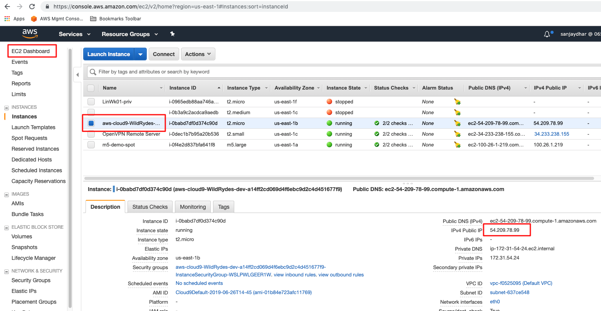
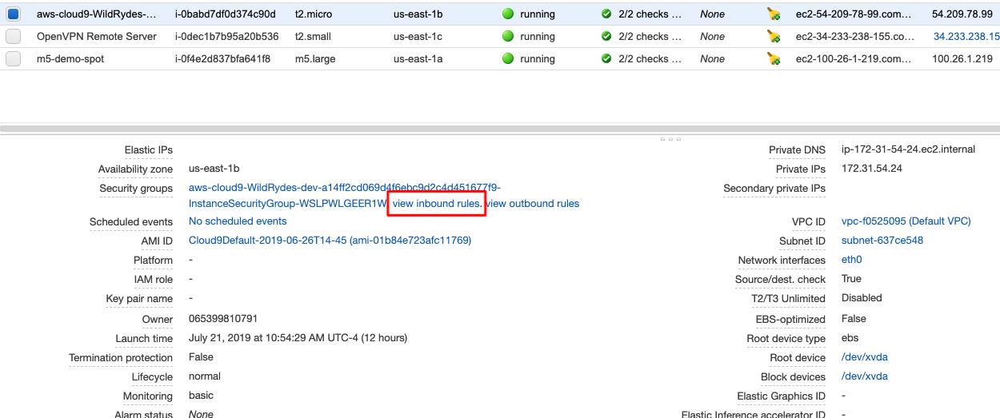

# Serverless Addendum

This is an addendum to the [AWS Serverless Workshops](https://github.com/aws-samples/aws-serverless-workshops)

## DevOps updates

### 1.  Using Cloud9 IDE

1. In a terminal window, generate SSH key pair that you can use to log into your Cloud9 instance and append to the `authorized_keys` file


  ```
ssh-keygen  
```
Give the key a name (Eg. my-key-pair)
```

Append the public key to the `authorized_keys` file
ssh-keygen -y -f /path_to_key_pair/my-key-pair.pem >> ~/.ssh/authorized_keys

  ```
  
  
2. Get the EC2 Public IP address for your Cloud9 instance (you will need it later)
 




3. Update the EC2 security group to allow all inbound  TCP traffic on port 22
 

4.  Open the private key pem file and copy the contents to your local machine (**NOTE:** If you're on a Mac, you will need to chmod 400 the file)
5.  If you're on Windows, you will need to [convert the pem file to ppk](https://aws.amazon.com/premiumsupport/knowledge-center/convert-pem-file-into-ppk/) 
 
